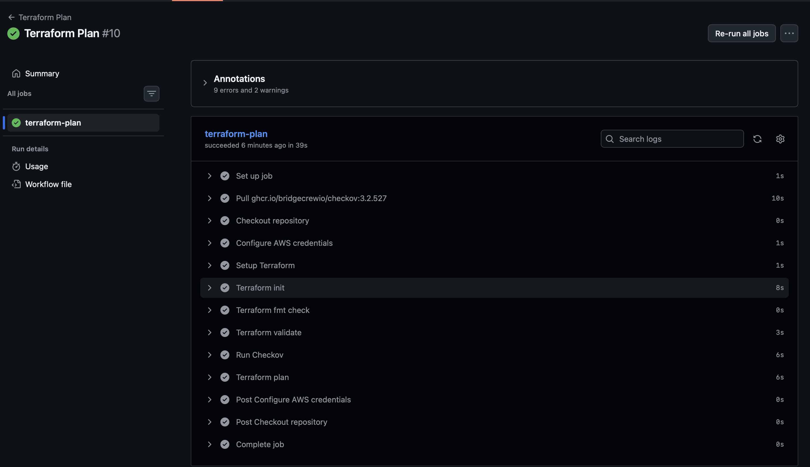
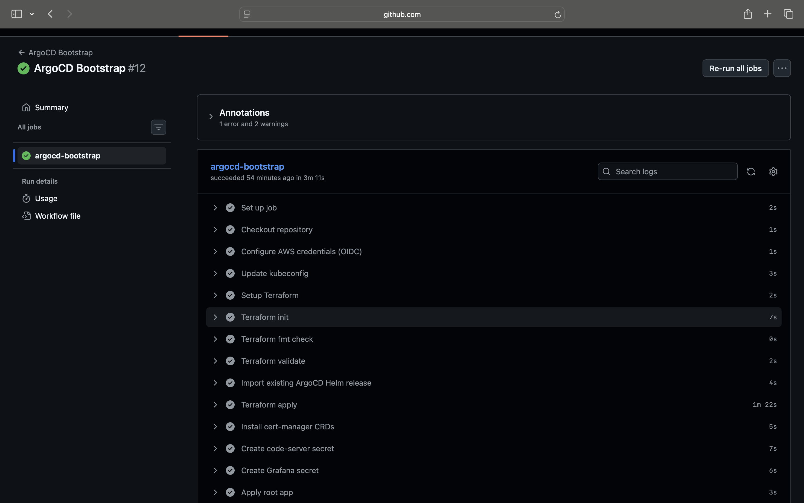

<h1 align="center">GitOps Kubernetes Platform on AWS EKS</h1>

<div align="center">


</div>

## Overview

## Overview

Production-grade GitOps Kubernetes platform running on AWS EKS, designed around secure infrastructure automation, declarative deployments and reproducible platform operations.

Infrastructure is provisioned entirely through Terraform across a custom multi-AZ VPC with public and private subnets. Remote Terraform state is stored in S3 using native state locking. The EKS cluster is bootstrapped through Helm, after which ArgoCD assumes control of all platform components using the App-of-Apps pattern.

The platform includes ingress-nginx for ingress routing, cert-manager for automated TLS issuance through Let's Encrypt, ExternalDNS for Route 53 record management, and Prometheus with Grafana for cluster observability.

CI/CD workflows are handled through GitHub Actions using OIDC federation, eliminating long-lived AWS credentials from the pipeline. AWS access inside the cluster is scoped through IRSA, with dedicated IAM roles mapped directly to Kubernetes service accounts.

Workloads run exclusively in private subnets behind an internet-facing Network Load Balancer. Persistent storage is provisioned dynamically through the AWS EBS CSI driver.

The deployed workload is code-server, a self-hosted VS Code environment running inside Kubernetes and exposed securely over HTTPS with fully automated DNS and certificate management.

## Live Application

The platform is live and accessible over HTTPS at [codeserver.moabdullahi.uk](https://codeserver.moabdullahi.uk).

[Watch Live Demo](docs/eks-platform-live-demo.mp4)

## Key Features

- Multi-AZ AWS EKS cluster with managed node groups
- Workload isolation through private subnet architecture
- Internet-facing Network Load Balancer with ingress-nginx routing
- GitOps reconciliation using ArgoCD and the App-of-Apps pattern
- Automated Route 53 DNS management via ExternalDNS
- Automated TLS issuance and renewal through cert-manager and Let's Encrypt
- Fine-grained AWS access control using IRSA
- OIDC-secured GitHub Actions CI/CD pipelines with zero static AWS credentials
- Container image security scanning with Trivy before ECR push
- Terraform static analysis integrated through Checkov
- Dynamic persistent storage provisioning via the AWS EBS CSI driver
- Cluster observability with Prometheus and Grafana

## Key Outcomes

- Resolved dynamic EBS volume provisioning failures caused by the absence of a default `gp3` storage class on EKS by deploying the AWS EBS CSI driver with IRSA-based authentication, replacing the deprecated in-tree provisioner

- Implemented fine-grained AWS access control through IRSA by binding dedicated IAM roles directly to Kubernetes service accounts instead of relying on broad node IAM permissions

- Automated end-to-end DNS and TLS reconciliation through ExternalDNS and cert-manager, enabling Route 53 record management and Let's Encrypt certificate issuance directly from Kubernetes ingress resources

- Built reproducible infrastructure workflows through Terraform covering VPC networking, EKS provisioning, IAM configuration, platform add-ons and ArgoCD bootstrap

- Automated Kubernetes-aware infrastructure teardown through a dedicated destroy pipeline capable of cleaning up Kubernetes-created AWS resources before executing `terraform destroy`

## Architecture


## Architecture Overview

Terraform provisions the AWS infrastructure, including the VPC, EKS cluster, IAM configuration and supporting platform components across two Availability Zones.

ArgoCD is bootstrapped initially through a Helm release in Terraform, after which all Kubernetes resources are managed declaratively from Git using the App-of-Apps pattern. Changes pushed to the repository are reconciled automatically against the cluster state.

The VPC is segmented across public and private subnets in both Availability Zones:

- Public subnets host the Internet Gateway, NAT Gateway and Network Load Balancer
- Private subnets host all EKS worker nodes and Kubernetes workloads
- Outbound traffic from private workloads is routed through the NAT Gateway, including image pulls from ECR

Traffic enters through Route 53 at `codeserver.moabdullahi.uk`, passes through the Network Load Balancer and into the NGINX Ingress controller running inside the cluster. The ingress layer routes requests to the appropriate Kubernetes services.

Platform components are isolated into dedicated namespaces:

- `monitoring` runs Prometheus and Grafana
- `code-server` runs the application workloads and services
- `cert-manager` handles TLS issuance through Let's Encrypt
- `external-dns` manages Route 53 DNS reconciliation
- `argocd` runs the GitOps control plane

CI/CD workflows are handled through GitHub Actions, which build and push container images to ECR and apply infrastructure changes through Terraform. ArgoCD continuously monitors the repository and reconciles manifest changes automatically.

## Pipeline Execution

## Terraform Plan Pipeline

The Terraform plan pipeline validates infrastructure changes before deployment by running formatting checks, validation, security analysis with Checkov and Terraform plan generation through GitHub Actions using OIDC authentication.



### Terraform Apply

Runs on merge to main. Applies infrastructure changes using OIDC-based authentication, no static AWS credentials stored anywhere.


---

### ArgoCD Bootstrap

Installs ArgoCD onto the cluster via Helm after the EKS cluster is provisioned, then applies the root application to hand control over to GitOps.



---

### Docker Build & Push

Triggers when the Dockerfile or application code changes. Builds the image, scans it with Trivy, pushes to ECR, and commits the updated image tag back to the deployment manifest. ArgoCD picks up the change and deploys automatically.


---

### Terraform Destroy

Tears down all infrastructure cleanly, including Kubernetes-created AWS resources, when triggered manually.


## Project Structure

```text
codeserver-eks-platform/
├── bootstrap/
│   ├── argocd/
│   └── backend/
├── code-server/
├── docs/
├── infra/
│   ├── modules/
│   │   ├── eks/
│   │   ├── eks-ebs-csi/
│   │   ├── external-dns-irsa/
│   │   ├── route53/
│   │   └── vpc/
│   ├── main.tf
│   ├── variables.tf
│   ├── outputs.tf
│   ├── provider.tf
│   └── backend.tf
├── kubernetes/
│   ├── apps/
│   │   ├── cert-manager.yaml
│   │   ├── code-server.yaml
│   │   ├── external-dns.yaml
│   │   ├── ingress-nginx.yaml
│   │   └── monitoring.yaml
│   ├── argocd/
│   │   └── root-app.yaml
│   └── deployments/
│       ├── argocd/
│       ├── cert-manager/
│       └── code-server/
└── Dockerfile
```

## Security Considerations

- EKS worker nodes run exclusively in private subnets with no public IP exposure
- IRSA implemented for ExternalDNS and the EBS CSI driver, with AWS permissions scoped directly to Kubernetes service accounts rather than node IAM roles
- ingress-nginx only accepts traffic originating from the Network Load Balancer
- HTTPS enforced through cert-manager and Let's Encrypt
- GitHub Actions pipelines authenticated through OIDC federation with zero static AWS credentials
- Terraform state stored remotely in S3 using native state locking
- Container images scanned with Trivy before push to ECR
- Terraform code analysed with Checkov on every pull request

## How to Reproduce This Project

Note: This project incurs AWS costs while running. Tear down infrastructure when not in use.

### Prerequisites

- Terraform >= 1.10
- AWS CLI configured with appropriate permissions
- `kubectl` and `helm` installed locally
- A registered domain with a subdomain delegated to a Route 53 hosted zone
- GitHub repository with the following secrets configured:

| Secret | Description |
|---|---|
| `AWS_ROLE_ARN` | IAM role ARN for OIDC authentication |
| `TF_VAR_hosted_zone_id` | Route 53 hosted zone ID |
| `TF_VAR_ECR_REPOSITORY_URL` | Full ECR repository URL |
| `TF_VAR_LOCAL_ADMIN_ARN` | IAM ARN for local admin access |

### 1. Clone the repository

```bash
git clone https://github.com/Mohamed-Abdullahi1/codeserver-eks-platform.git
cd codeserver-eks-platform
```

### 2. Bootstrap the state backend

```bash
cd bootstrap/backend
terraform init
terraform apply
```

### 3. Deploy infrastructure

Push to main to trigger the Terraform apply pipeline, or trigger manually via `workflow_dispatch` in the Actions tab.

### 4. Apply the ArgoCD root application

Once ArgoCD is running, apply the root app to start GitOps reconciliation:

```bash
kubectl apply -f kubernetes/argocd/root-app.yaml
```

### 5. Create the code-server secret

The application password is not stored in Git. Create it manually on the cluster:

```bash
kubectl create secret generic code-server-secret \
  --from-literal=PASSWORD='your-password' \
  -n code-server
```

### 6. Tear down

Trigger the destroy pipeline manually via `workflow_dispatch` in the Actions tab.