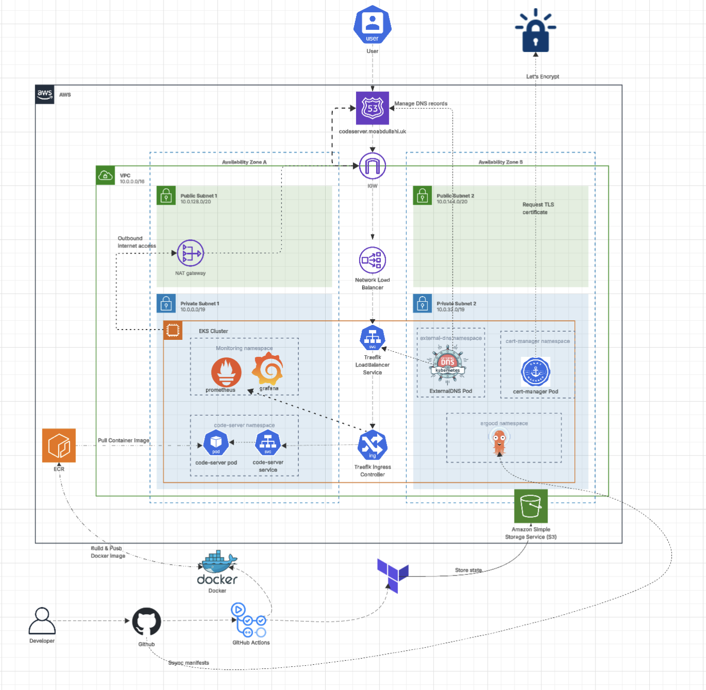
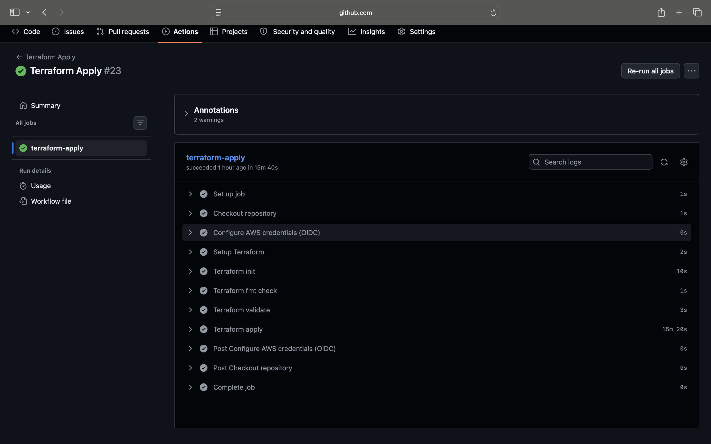
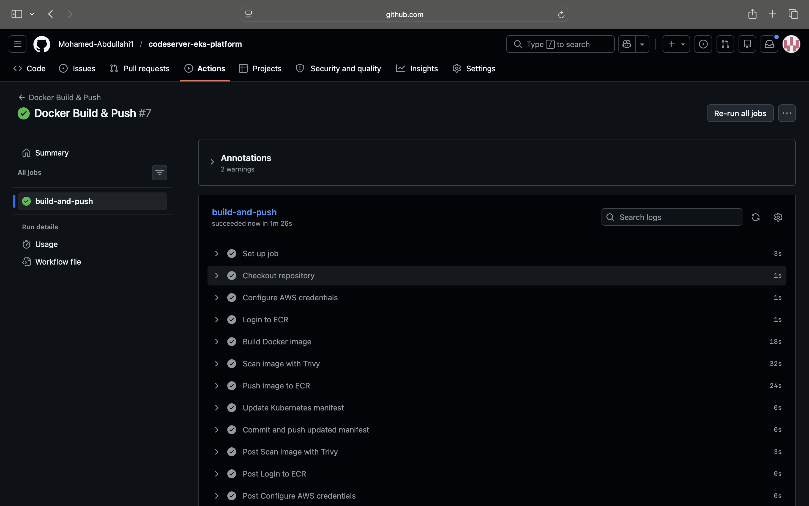
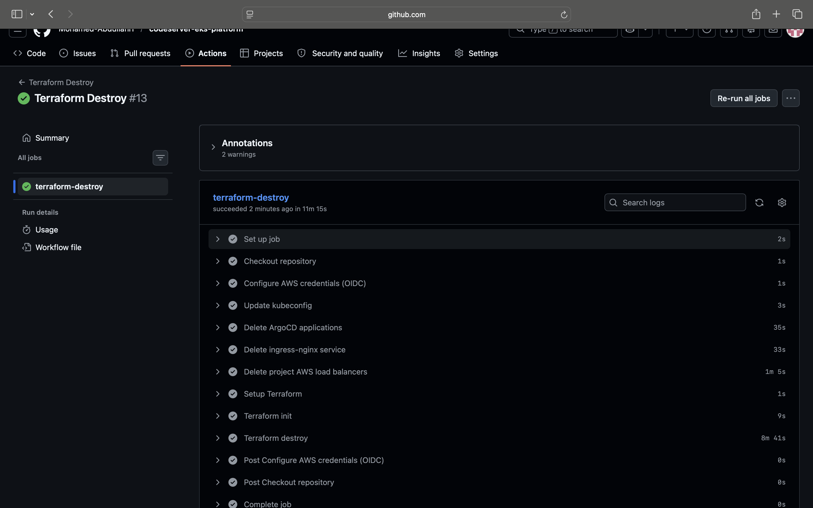

# GitOps Kubernetes Platform on AWS EKS


## Overview

A production-grade Kubernetes platform on AWS EKS, built to reflect how platforms are actually run rather than how they are typically demonstrated.

Infrastructure is provisioned entirely through Terraform across a custom VPC with public and private subnets, deployed over multiple availability zones. State is managed remotely in S3 using native locking. The EKS cluster is bootstrapped with ArgoCD via a Helm release, after which all platform components are reconciled from Git using the App-of-Apps pattern.

Platform services include ingress-nginx for traffic routing, cert-manager for automated TLS provisioning via Let's Encrypt, ExternalDNS for dynamic Route 53 record management, and Prometheus with Grafana for cluster observability. CI/CD is handled through GitHub Actions using OIDC authentication, with no long-lived AWS credentials stored anywhere.

The deployed workload is code-server, a self-hosted VS Code environment running inside the cluster, accessible over HTTPS with fully automated DNS and certificate management.

## Live Application

The platform is live and accessible over HTTPS at [codeserver.moabdullahi.uk](https://codeserver.moabdullahi.uk).

[Watch Live Demo](docs/eks-platform-live-demo.mp4)

## Key Features

- EKS cluster deployed across multiple Availability Zones with managed node groups
- Private subnet isolation for all workloads
- Internet-facing Network Load Balancer for controlled ingress
- GitOps-driven deployments using ArgoCD with the App-of-Apps pattern
- Automated DNS management via ExternalDNS and Route 53
- Automatic TLS certificate issuance and renewal via cert-manager and Let's Encrypt
- IRSA used throughout, no broad node IAM permissions
- CI/CD pipelines via GitHub Actions with OIDC authentication, no static AWS credentials
- Docker image scanning with Trivy before push to ECR
- Terraform static analysis with Checkov in the plan pipeline
- Persistent storage provisioned dynamically using the AWS EBS CSI driver
- Full cluster observability with Prometheus and Grafana

## Key Outcomes

- Resolved a dynamic volume provisioning failure caused by the `gp3` storage class not being available by default on EKS. Fixed by installing and configuring the AWS EBS CSI driver with a dedicated IRSA role, enabling Kubernetes to provision EBS volumes without relying on the deprecated in-tree provisioner

- Scoped AWS permissions at the service account level using IRSA for ExternalDNS, rather than attaching broad permissions to the node IAM role. Each component that needs AWS access has its own role bound to a specific Kubernetes service account

- Automated DNS and TLS end to end. When an ingress resource is created or updated, ExternalDNS updates Route 53 automatically and cert-manager handles certificate issuance and renewal without any manual steps

- The cluster is reproducible through Terraform, covering the VPC, EKS cluster, IAM roles, add-ons, and ArgoCD bootstrap. EKS teardown is handled by the destroy pipeline, which cleans up Kubernetes-created AWS resources (load balancers, security groups) before running `terraform destroy`

## Architecture



## Architecture Overview

Terraform provisions the VPC and EKS cluster across two Availability Zones. ArgoCD is installed once via a Helm release in Terraform, and from that point manages all platform components from Git using the App-of-Apps pattern. When a change is pushed to the repository, ArgoCD reconciles the cluster to match the desired state.

The VPC is split into public and private subnets across both zones:

- Public subnets host the Internet Gateway and Network Load Balancer
- Private subnets host all EKS worker nodes and workloads
- A NAT Gateway in the public subnet handles outbound traffic from private workloads, including pulling images from ECR

Traffic flows from the user through Route 53 at `codeserver.moabdullahi.uk`, into the Internet Gateway, down to the Network Load Balancer, and into the NGINX Ingress controller running inside the cluster. The ingress controller routes requests to the appropriate Kubernetes service.

Workloads are organised into dedicated namespaces inside the EKS cluster:

- `monitoring` namespace runs Prometheus and Grafana
- `code-server` namespace runs the application pod and service
- `cert-manager` namespace handles TLS certificate issuance via Let's Encrypt
- `external-dns` namespace manages Route 53 DNS records automatically
- `argocd` namespace runs the GitOps controller

On the CI/CD side, developers push to GitHub, GitHub Actions builds and pushes the Docker image to ECR, and Terraform state is stored remotely in S3. ArgoCD then picks up any manifest changes and reconciles the cluster automatically.

## Pipeline Execution

### Terraform Apply

Runs on merge to main. Applies infrastructure changes using OIDC-based authentication, no static AWS credentials stored anywhere.



---

### ArgoCD Bootstrap

Installs ArgoCD onto the cluster via Helm after the EKS cluster is provisioned, then applies the root application to hand control over to GitOps.


---

### Docker Build & Push

Triggers when the Dockerfile or application code changes. Builds the image, scans it with Trivy, pushes to ECR, and commits the updated image tag back to the deployment manifest. ArgoCD picks up the change and deploys automatically.



---

### Terraform Destroy

Tears down all infrastructure cleanly, including Kubernetes-created AWS resources, when triggered manually.



## Project Structure

```text
codeserver-eks-platform/
├── bootstrap/
│   ├── argocd/
│   └── backend/
├── code-server/
├── docs/
├── infra/
│   ├── modules/
│   │   ├── eks/
│   │   ├── eks-ebs-csi/
│   │   ├── external-dns-irsa/
│   │   ├── route53/
│   │   └── vpc/
│   ├── main.tf
│   ├── variables.tf
│   ├── outputs.tf
│   ├── provider.tf
│   └── backend.tf
├── kubernetes/
│   ├── apps/
│   │   ├── cert-manager.yaml
│   │   ├── code-server.yaml
│   │   ├── external-dns.yaml
│   │   ├── ingress-nginx.yaml
│   │   └── monitoring.yaml
│   ├── argocd/
│   │   └── root-app.yaml
│   └── deployments/
│       ├── argocd/
│       ├── cert-manager/
│       └── code-server/
└── Dockerfile
```

## Security Considerations

- EKS worker nodes run in private subnets with no public IP addresses
- IRSA used for ExternalDNS and EBS CSI driver, permissions scoped to specific Kubernetes service accounts, not node roles
- NGINX Ingress only accepts traffic from the NLB
- HTTPS enforced via cert-manager and Let's Encrypt
- OIDC authentication for GitHub Actions, no static AWS credentials in CI/CD
- Terraform state stored remotely in S3 with native state locking (Terraform v1.10+)
- Docker images scanned with Trivy before being pushed to ECR
- Terraform code scanned with Checkov on every pull request

## How to Reproduce This Project

Note: This project incurs AWS costs while running. Tear down infrastructure when not in use.

### Prerequisites

- Terraform >= 1.10
- AWS CLI configured with appropriate permissions
- `kubectl` and `helm` installed locally
- A registered domain with a subdomain delegated to a Route 53 hosted zone
- GitHub repository with the following secrets configured:

| Secret | Description |
|---|---|
| `AWS_ROLE_ARN` | IAM role ARN for OIDC authentication |
| `TF_VAR_hosted_zone_id` | Route 53 hosted zone ID |
| `TF_VAR_ECR_REPOSITORY_URL` | Full ECR repository URL |
| `TF_VAR_LOCAL_ADMIN_ARN` | IAM ARN for local admin access |

### 1. Clone the repository

```bash
git clone https://github.com/Mohamed-Abdullahi1/codeserver-eks-platform.git
cd codeserver-eks-platform
```

### 2. Bootstrap the state backend

```bash
cd bootstrap/backend
terraform init
terraform apply
```

### 3. Deploy infrastructure

Push to main to trigger the Terraform apply pipeline, or trigger manually via `workflow_dispatch` in the Actions tab.

### 4. Apply the ArgoCD root application

Once ArgoCD is running, apply the root app to start GitOps reconciliation:

```bash
kubectl apply -f kubernetes/argocd/root-app.yaml
```

### 5. Create the code-server secret

The application password is not stored in Git. Create it manually on the cluster:

```bash
kubectl create secret generic code-server-secret \
  --from-literal=PASSWORD='your-password' \
  -n code-server
```

### 6. Tear down

Trigger the destroy pipeline manually via `workflow_dispatch` in the Actions tab.